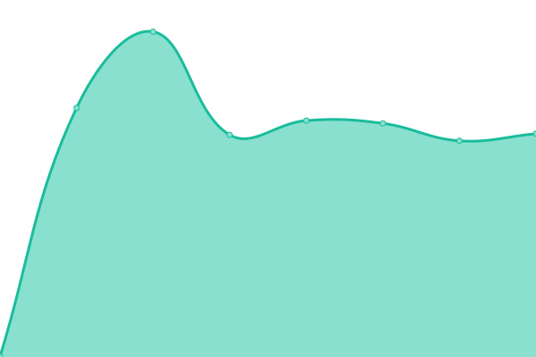
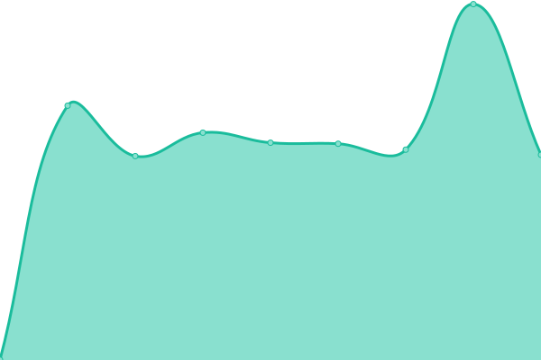

# [📈 Live Status](https://sanderdatema.github.io/upptime): <!--live status--> **🟩 All systems operational**

This repository contains the open-source uptime monitor and status page for [Sander Datema](https://healthcareonstage.com), powered by [Upptime](https://github.com/upptime/upptime).

With [Upptime](https://upptime.js.org), you can get your own unlimited and free uptime monitor and status page, powered entirely by a GitHub repository. We use [Issues](https://github.com/sanderdatema/upptime/issues) as incident reports, [Actions](https://github.com/sanderdatema/upptime/actions) as uptime monitors, and [Pages](https://sanderdatema.github.io/upptime) for the status page.

<!--start: status pages-->
<!-- This summary is generated by Upptime (https://github.com/upptime/upptime) -->
<!-- Do not edit this manually, your changes will be overwritten -->
<!-- prettier-ignore -->
| URL | Status | History | Response Time | Uptime |
| --- | ------ | ------- | ------------- | ------ |
|  [Sander Datema](https://sanderdatema.nl) | 🟩 Up | [sander-datema.yml](https://github.com/sanderdatema/upptime/commits/HEAD/history/sander-datema.yml) | 

 537ms
     
 | 

<a href="https://sanderdatema.github.io/upptime/history/sander-datema">100.00%</a>
    

|  [Return to Sander](https://returntosander.net) | 🟩 Up | [return-to-sander.yml](https://github.com/sanderdatema/upptime/commits/HEAD/history/return-to-sander.yml) | 

 478ms
     
 | 

<a href="https://sanderdatema.github.io/upptime/history/return-to-sander">100.00%</a>
    

|  [Passenger Flying](https://passengerflying.com) | 🟩 Up | [passenger-flying.yml](https://github.com/sanderdatema/upptime/commits/HEAD/history/passenger-flying.yml) | 

 599ms
     
 | 

<a href="https://sanderdatema.github.io/upptime/history/passenger-flying">100.00%</a>
    

|  [Stats](https://stats.returntosander.net) | 🟩 Up | [stats.yml](https://github.com/sanderdatema/upptime/commits/HEAD/history/stats.yml) | 

 417ms
     
 | 

<a href="https://sanderdatema.github.io/upptime/history/stats">100.00%</a>
    

|  [Return to Sander links](https://link.returntosander.net) | 🟩 Up | [return-to-sander-links.yml](https://github.com/sanderdatema/upptime/commits/HEAD/history/return-to-sander-links.yml) | 

 715ms
     
 | 

<a href="https://sanderdatema.github.io/upptime/history/return-to-sander-links">100.00%</a>
    

|  [Sander Datema links](https://link.sanderdatema.nl) | 🟩 Up | [sander-datema-links.yml](https://github.com/sanderdatema/upptime/commits/HEAD/history/sander-datema-links.yml) | 

 650ms
     
 | 

<a href="https://sanderdatema.github.io/upptime/history/sander-datema-links">100.00%</a>
    

|  [Passenger Flying links](https://link.passengerflying.com) | 🟩 Up | [passenger-flying-links.yml](https://github.com/sanderdatema/upptime/commits/HEAD/history/passenger-flying-links.yml) | 

 987ms
     
 | 

<a href="https://sanderdatema.github.io/upptime/history/passenger-flying-links">100.00%</a>
    

|  [Return to Sander Git](https://git.returntosander.net) | 🟩 Up | [return-to-sander-git.yml](https://github.com/sanderdatema/upptime/commits/HEAD/history/return-to-sander-git.yml) | 

 458ms
     
 | 

<a href="https://sanderdatema.github.io/upptime/history/return-to-sander-git">100.00%</a>
    

<!--end: status pages-->

[**Visit our status website →**](https://sanderdatema.github.io/upptime)

## 📄 License

- Powered by: [Upptime](https://github.com/upptime/upptime)
- Code: [MIT](./LICENSE) © [Sander Datema](https://healthcareonstage.com)
- Data in the `./history` directory: [Open Database License](https://opendatacommons.org/licenses/odbl/1-0/)
