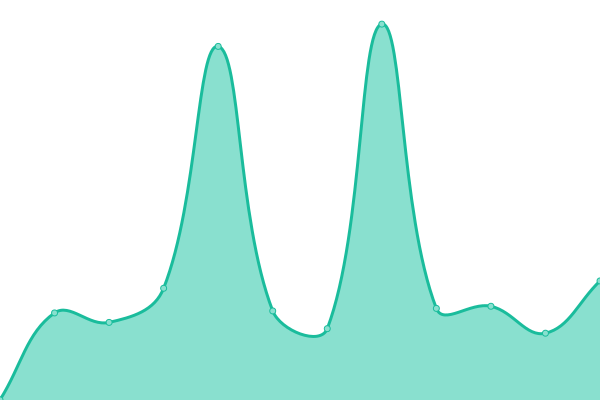

# [📈 Live Status](https://sanderdatema.github.io/upptime): <!--live status--> **🟥 Complete outage**

This repository contains the open-source uptime monitor and status page for [Sander Datema](https://healthcareonstage.com), powered by [Upptime](https://github.com/upptime/upptime).

With [Upptime](https://upptime.js.org), you can get your own unlimited and free uptime monitor and status page, powered entirely by a GitHub repository. We use [Issues](https://github.com/sanderdatema/upptime/issues) as incident reports, [Actions](https://github.com/sanderdatema/upptime/actions) as uptime monitors, and [Pages](https://sanderdatema.github.io/upptime) for the status page.

<!--start: status pages-->
<!-- This summary is generated by Upptime (https://github.com/upptime/upptime) -->
<!-- Do not edit this manually, your changes will be overwritten -->
<!-- prettier-ignore -->
| URL | Status | History | Response Time | Uptime |
| --- | ------ | ------- | ------------- | ------ |
|  [Sander Datema](https://sanderdatema.nl) | 🟥 Down | [sander-datema.yml](https://github.com/sanderdatema/upptime/commits/HEAD/history/sander-datema.yml) | 

 1118ms
     
 | 

<a href="https://sanderdatema.github.io/upptime/history/sander-datema">83.61%</a>
    

|  [Curated Distractions](https://curateddistractions.com) | 🟥 Down | [curated-distractions.yml](https://github.com/sanderdatema/upptime/commits/HEAD/history/curated-distractions.yml) | 

 1235ms
     
 | 

<a href="https://sanderdatema.github.io/upptime/history/curated-distractions">94.18%</a>
    

|  [Naakt Presenteren](https://naaktpresenteren.nl) | 🟥 Down | [naakt-presenteren.yml](https://github.com/sanderdatema/upptime/commits/HEAD/history/naakt-presenteren.yml) | 

 1161ms
     
 | 

<a href="https://sanderdatema.github.io/upptime/history/naakt-presenteren">99.05%</a>
    

|  [Return to Sander](https://returntosander.net) | 🟥 Down | [return-to-sander.yml](https://github.com/sanderdatema/upptime/commits/HEAD/history/return-to-sander.yml) | 

 826ms
     
 | 

<a href="https://sanderdatema.github.io/upptime/history/return-to-sander">99.05%</a>
    

|  [Pleroma](https://pleroma.returntosander.net) | 🟥 Down | [pleroma.yml](https://github.com/sanderdatema/upptime/commits/HEAD/history/pleroma.yml) | 

 778ms
     
 | 

<a href="https://sanderdatema.github.io/upptime/history/pleroma">95.92%</a>
    

|  [Stats](https://stats.returntosander.net) | 🟥 Down | [stats.yml](https://github.com/sanderdatema/upptime/commits/HEAD/history/stats.yml) | 

 1120ms
     
 | 

<a href="https://sanderdatema.github.io/upptime/history/stats">97.75%</a>
    

|  [Minio](https://console.returntosander.net) | 🟥 Down | [minio.yml](https://github.com/sanderdatema/upptime/commits/HEAD/history/minio.yml) | 

 1091ms
     
 | 

<a href="https://sanderdatema.github.io/upptime/history/minio">97.75%</a>
    

|  [Gitea](https://git.returntosander.net) | 🟥 Down | [gitea.yml](https://github.com/sanderdatema/upptime/commits/HEAD/history/gitea.yml) | 

 1087ms
     
 | 

<a href="https://sanderdatema.github.io/upptime/history/gitea">97.76%</a>
    

<!--end: status pages-->

[**Visit our status website →**](https://sanderdatema.github.io/upptime)

## 📄 License

- Powered by: [Upptime](https://github.com/upptime/upptime)
- Code: [MIT](./LICENSE) © [Sander Datema](https://healthcareonstage.com)
- Data in the `./history` directory: [Open Database License](https://opendatacommons.org/licenses/odbl/1-0/)
